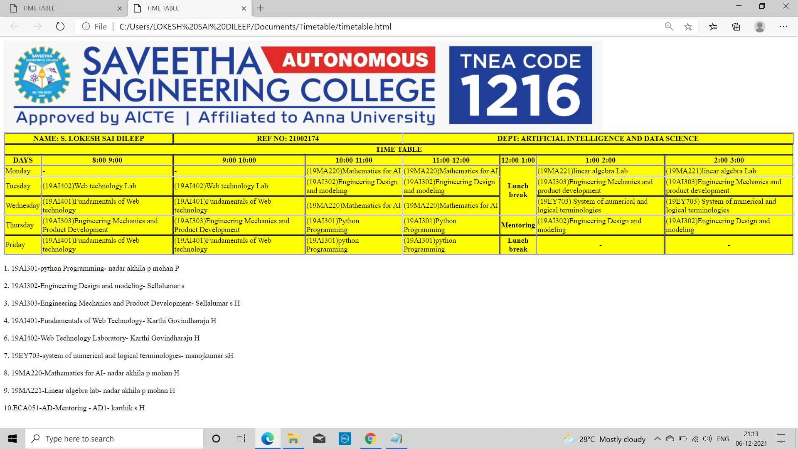

# Experiment_Time_Table

## AIM
To Write a html webpage page to display your timetable.

# ALGORITHM
### STEP 1
create a simple table using table tag
### STEP 2
Add header row using th tag
### STEP 3
Add your timetable
### STEP 4
Execute the program

# CODE
~~~<!DOCTYPE html>
<html>

   <head>
      <title>TIME TABLE</title>
   </head>
	
   <body>
      <table border = "1" cellspacing="1" bordercolor="blue" bgcolor="yellow">
      
          <tr>
            <th colspan="2"> NAME: S. LOKESH SAI DILEEP
            <th colspan="2"> REF NO: 21002174
            <th colspan="6"> DEPT: ARTIFICIAL INTELLIGENCE AND DATA SCIENCE</th>
         </tr>
         <tr>
            <th colspan="8">TIME TABLE</th>
          </tr>
         
         <tr>
            <th>DAYS</th>
            <th>8:00-9:00</th>
            <th>9:00-10:00</th>
            <th>10:00-11:00</th>
             <th>11:00-12:00</th>
             <th>12:00-1:00</th>
            <th>1:00-2:00</th>
            <th>2:00-3:00</th>
            
         </tr>
         
        
  
  <tr>
             <td>Monday</td>
             <td>-</td>
             <td>-</td>
             <td>(19MA220)Mathematics for AI</td>
             <td>(19MA220)Mathematics for AI</td>
         <th rowspan="3">Lunch break</th>
             <td>(19MA221)linear algebra Lab</td>
             <td>(19MA221)linear algebra Lab</td>
 </tr>
 <tr>
             <td>Tuesday</td>
             <td>(19AI402)Web technology Lab</td>
             <td>(19AI402)Web technology Lab</td>
             <td>(19AI302)Engineering Design and modeling</td>
             <td>(19AI302)Engineering Design and modeling</td>
              
             <td>(19AI303)Engineering Mechanics and product development</td>
             <td>(19AI303)Engineering Mechanics and product development</td>
 </tr>
 <tr>
             <td>Wednesday</td>
             <td>(19AI401)Fundamentals of Web technology </td>
             <td>(19AI401)Fundamentals of Web technology</td>
             <td>(19MA220)Mathematics for AI </td>
             <td>(19MA220)Mathematics for AI </td>
             
             <td>(19EY703) System of numerical and logical terminologies</td>
             <td>(19EY703) System of numerical and logical terminologies</td>
 </tr>
  <tr>
             <td>Thursday</td>
             <td>(19AI303)Engineering Mechanics and Product Development</td>
             <td>(19AI303)Engineering Mechanics and Product Development</td>
             <td>(19AI301)Python Programming </td>
             <td>(19AI301)Python Programming</td>
             <th>Mentoring</th>
          
             <td>(19AI302)Engineering Design and modeling</td>
             <td>(19AI302)Engineering Design and modeling</td>
 </tr>
 <tr>
             <td>Friday</td>
             <td>(19AI401)Fundamentals of Web technology</td>
             <td>(19AI401)Fundamentals of Web technology</td>
             <td>(19AI301)python Programming </td>
             <td>(19AI301)python Programming</td>
             <th>Lunch break</th>
            
             <td>
-
</td>
             <td>
-
</td>
 </tr>
  
         
      </table>
       1. 19AI301-python Programming-                            nadar akhila p mohan          P 
       2. 19AI302-Engineering Design and modeling-               Sellalumar s  
       3. 19AI303-Engineering Mechanics and Product Development- Sellalumar s H 
       4. 19AI401-Fundamentals of Web Technology-                Karthi Govindharaju    H 
       6. 19AI402-Web Technology Laboratory-                     Karthi Govindharaju  H 
       7. 19EY703-system of numerical and logical terminologies- manojkumar sH 
       8. 19MA220-Mathematics for AI-                            nadar akhila p mohan H 
       9. 19MA221-Linear algebra lab-                            nadar akhila p mohan H 
       10.ECA051-AD-Mentoring - AD1-                             karthik s H 
      
   </body>
</html>

~~~
# OUTPUT

## Result:-
Therefore designing a time table using html code is successful.